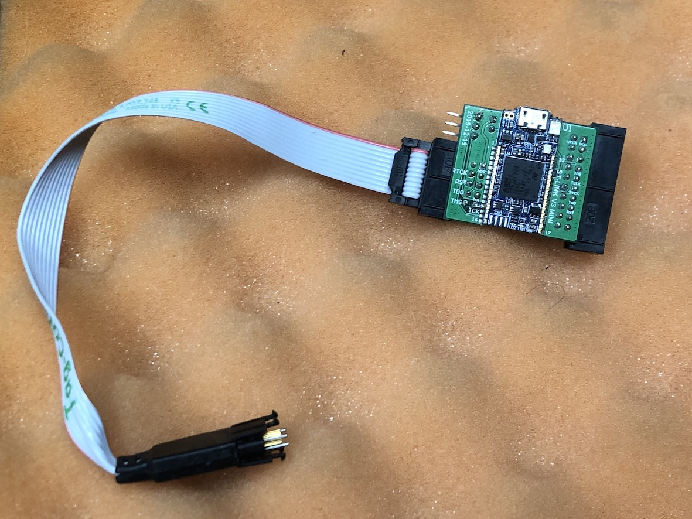
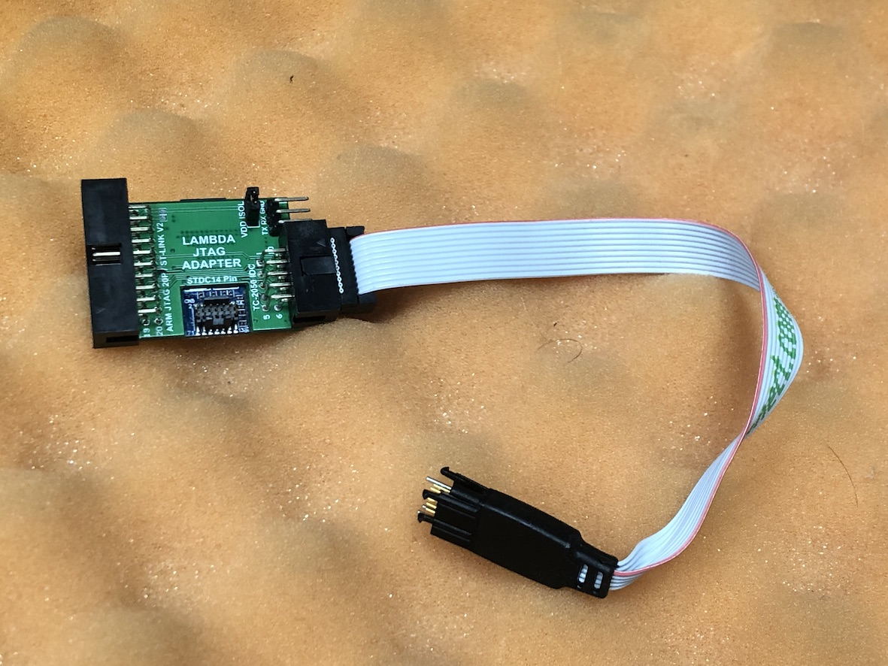
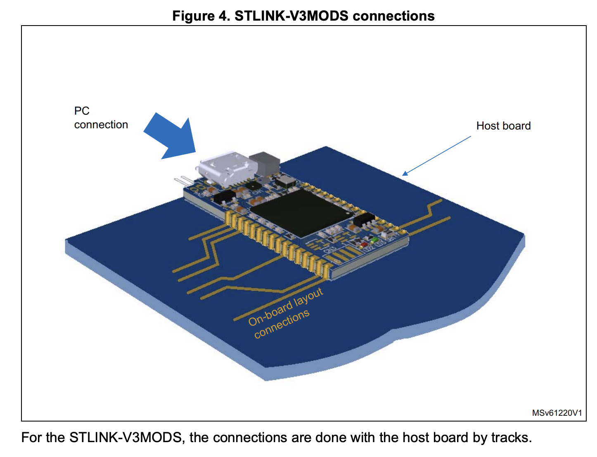

Lambda-STLINKv3
=========================

### Alternative PCB for cheap use of STLINK-V3

#### PCB Routing for public usage version is WIP. Please Wait

Front Side | Back Side
---|:---:|
|
_This PCB design is part of Inc.GPARK's works. But it's being open for public usage._

Lambda-STLINKv3 uses legit STLINK-V3 MINI from STMicroelectronics.

This PCB may suitable when deploy lots of STLINK in project members or any purpose but wanna decrease prices for buy STLINK-V3.

BOM
-------------------------

Total Price /wo POGO Cable : aprx 12.5 USD

Total Price /w  POGO Cable : aprx 51.5 USD

Standalone STLINK-V3SET : 35.0 USD

Designator | Parts name | Alter Avail | Qty | Prices 
---:|---:|---:|---:|---:|
U1 | STLINK-V3MINI | No | 1 | 10.16$
J1 | 61202021721 | Yes | 1 | 0.90$
J2 | 61201021721 | Yes | 1 | 0.65$
J3 | 61300211121 | Yes | 1 | 0.10$
J4 | 61300311021 | Yes | 1 | 0.30$
Jumper | M7582-05 | Yes | 1 | 0.10$
Extra Cable | TC2050-IDC | ? | 1 | 39.00$

_TC2050-IDC is extra for pogo-pin usage_ 

Make your own custom way
-------------------------

[DM0055046.pdf](https://www.st.com/resource/en/user_manual/dm00555046-stlinkv3mods-and-stlinkv3mini-mini-debuggersprogrammers-for-stm32-stmicroelectronics.pdf)

Lambd-STLINKV3 is following STMicroelectronics' suggest. So you create own breakout board for STM32-JTAG/SWD.

License
-------------------------
MIT License

Jinwoo Park - pmnxis@gmail.com

Inc. GPARK  - dev@gpark.biz